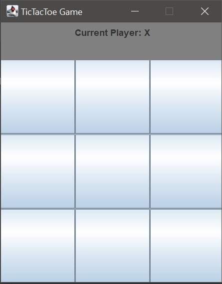
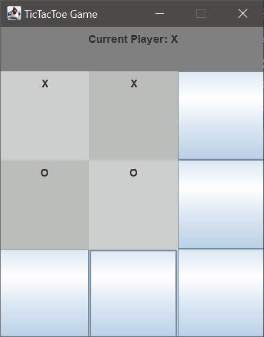
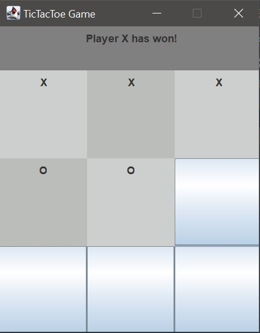

# Hello
This is a basic tictactoe gui game I made in Java using Swing and AWT libraries.
It's another simple project for me to practice programming.

# How to use
Everything is in the Main class. Just compile and run it.
Have fun :)

Here's how it looks like in action:

